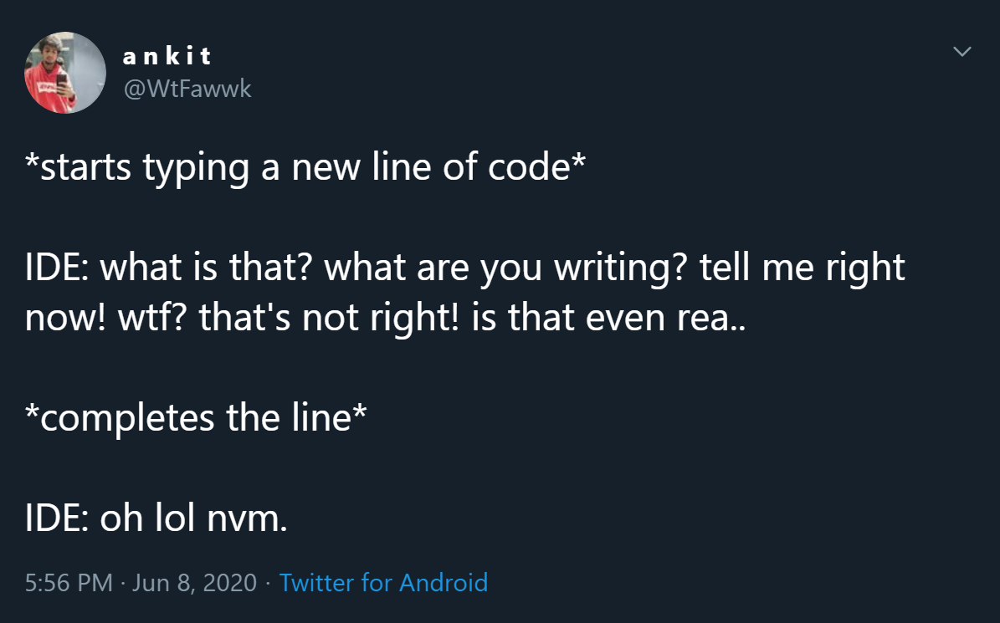

# Hotheaded VS Code

Are red squiggly lines not enough?  
Do you wish for more of a kick when you make an error?  
Have VS Code scream at you whenever you type something that isn't correct.

## Features

* ☠ Makes me want to die
* 😱 VS Code literally screams at you the second something's wrong
* 💬 Awesome voice lines by [Dalfaria](https://twitter.com/Dalfairy)
  from [fiverr](https://www.fiverr.com/dalfaria)

## Background

  
The tweet that inspired me to create this abomination

## Non Window users look here!

This extension uses platform specific binaries and the version in the extension
store only is built for Windows. I'm sorry, but you'll have to build it yourself
to use it. Clone [the repo](https://github.com/89netraM/hotheaded-vscode) and
then follow the instructions in the [CONTRIBUTING document](./CONTRIBUTING.md)
on how to build it.

## Bugs

If you find any bugs (or anything else you think might be a problem) visit the
[issue section](https://github.com/89netraM/hotheaded-vscode/issues)
of the [repository](https://github.com/89netraM/hotheaded-vscode).